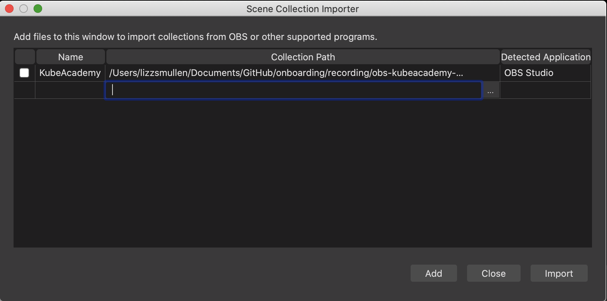
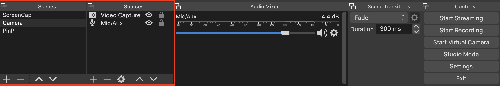
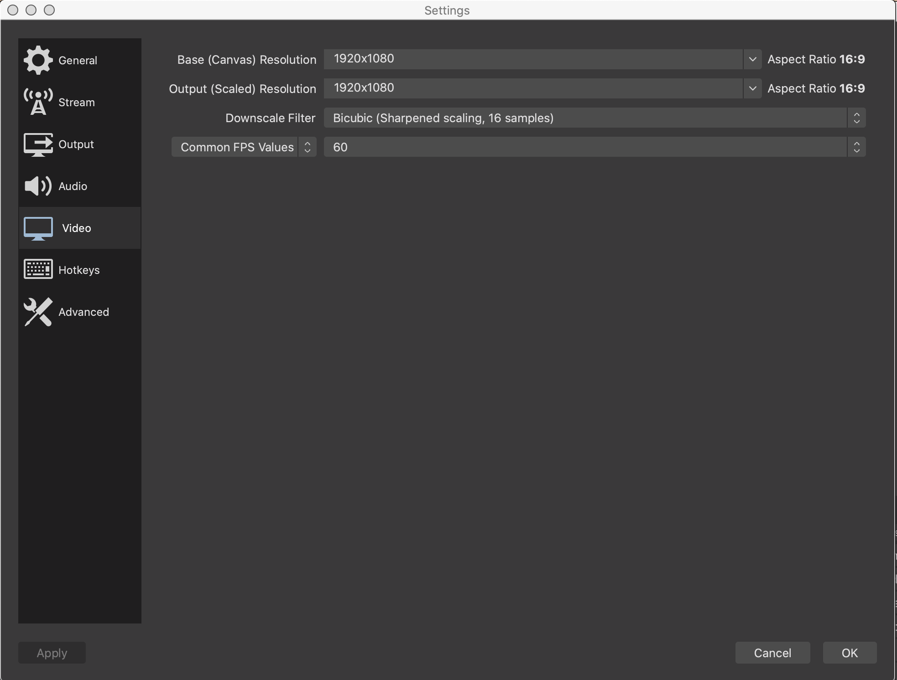

# Add Video Scenes

KubeAcademy provides three video scenes for you to use when recording a video. You can open these scenes in OBS by importing a json file from the [GitHub KubeAcademy Onboarding repository](https://github.com/kube-academy/onboarding/tree/main/recording).

The three scenes include:

- **ScreenCap**. Select this scene to capture your screen and mic in the video.
- **Camera**. Select this scene to capture your webcam and mic in the video.
- **PinP**. Select this scene to capture your screen as the primary source, camera as the secondary, picture-in-picture source, and mic in the video.

This configuration is necessary because the original scene collection file that was exported came from another computer with different sources.

To add the three video scenes to OBS:

1. From the OBS menu bar, go **Scene Collection** > **Import**.

   The Scene Collection Importer appears.

   

2. Select **Add** at the bottom of the panel. 

   A navigation panel opens. 

3. Go **GitHub** > **Onboarding** > **Recording** > **obs-kubeacademy-scenes.json**, then select **Open** at the bottom of the panel.

   The three scenes display in the Scenes panel along with their corresponding sources in the Sources panel at the bottom of the OBS page. 

   
   
4. From the OBS menu bar, go **OBS** > **Preferences** > **Video**. 

5. From the Settings panel, ensure that the Base (Canvas) Resolution value and the Output (Scaled Resolution and Output resolution value are both set to **1920x1080**. Select **OK**.

   

----
See also:

- [Install OBS Studio](install-obs-studio.md)
- [Set Up Audio Devices](audio-device-setup.md)
- [Remux the Video](remux-the-video.md)
- [Required Video Equipment](../contributor-onboarding/required-video-equipment.md)
- [Video Lighting](../contributor-onboarding/video-lighting.md)

----
#### **[Go to README](../README.md)** 