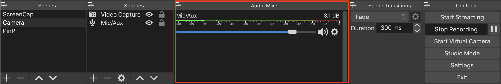

# Audio Device Setup

You can verify that the default desktop audio and microphone selected by OBS-Studio during installation are properly working by looking at the Mic/Aux volume meter in the Audio Mixer pane of the OBS main window to ensure that it is moving. 

## Manually Update an Audio Device

If the Mic/Aux volume meter is not moving, or you would like to change the audio to a different device, go **OBS** > **Preferences** > **Audio** on the menu bar to manually update the device. 

----
See also:

[Install OBS Studio](video-recording-setup/audio-device-setup.md)
[Add Video Scenes to OBS Studio](video-recording-setup/add-video-scenes.md)
[Remux the Video](video-recording-setup/remux-the-video.md)
[Required Video Equipment](contributors-guide/video-recording-guide/required-video-equipment.md)
[Video Lighting](contributors-guide/video-recording-guide/video-lighting.md)

----
See also:

----
#### **[Go to README](README.md)** 

