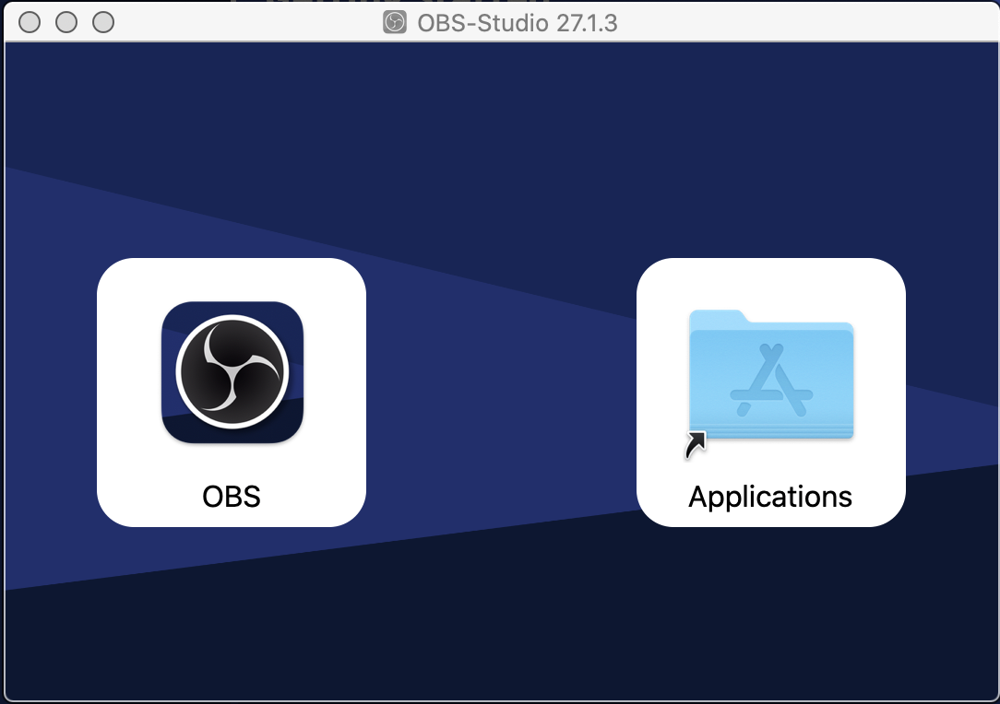

# Install OBS-Studio

Open Broadcaster Software Studio is a free and open source software for you to use when video recording content for KubeAcademy.  

To get started, do the following:

1. Go to [Open Broadcaster Software (OBS)](https://obsproject.com/).
2. Select the operating environment where you want to install OBS. There are three options: Windows, macOS 10.13+, and Linux.

   The OBS installer appears in the bottom, left corner of the page.

3. Run the OBS installer.

   The OBS-Studio panel appears.

   

4. Select **OBS**.

   The Auto-Configuration Wizard appears. 
   
   Note: To manually open the Auto-Configuration Wizard, go **Tools** > **Auto-Configuration Wizard** on the menu bar.

5. Run the Auto-Configuration Wizard.

   The auto-configuration-wizard tests your system to determine the default settings to use for video recording, resolution, and bitrate. 

6. From the Auto-Configuration-Wizard, select **Apply Settings** once testing is complete. 

   Note: To manually change the default settings, go **OBS** > **Preferences** on the menu bar.

----
See also:

- [Required Video Equipment](contributors-guide/contributor-onboarding/required-video-equipment.md)
- [Setup Audio Devices](contributors-guide/video-recording-guide/audio-device-setup.md)
- [Add Video Scenes](contributors-guide/video-recording-setup/add-video-scenes.md)
- [KubeAcademy New Course Template](contributors-guide/contributor-onboarding/kubeacademy-powerpoint-new-course-template.md)
- [Hello World Sample Video](contributors-guide/contributor-onboarding/hello-world-sample-video.md)

----
#### **[Go to README](contributors-guide/README.md)** 
