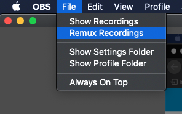
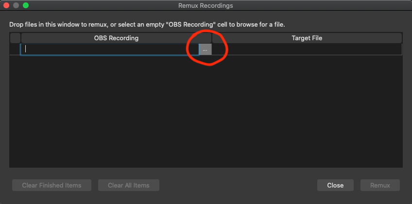
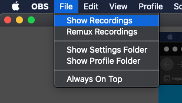

# Remux the Video

Once you are done recording your video, you are going to need to remux it. This is because OBS records videos as mkv files, but KubeAcademy only accepts videos in the mp4 format. 

To remux your video: 

1. Go **File** > **Remux Recordings** from the menu bar.

   

   The Remux Recordings dialog appears.

2. Select the ellipsis and navigate to the file requiring the remux.

   

3. Select the file. Select **Remux** at the bottom of the dialog.

   A message indicating that the remux is complete appears.

4. Select **OK** to close the message. 

5. Select **Close** to close the Remux Recordings dialog.

## Rename the mp4 Video

Once you remux a video from mkv to mp4, make sure to:

- Rename the mp4 video.
- Upload the mp4 video to your Google drive.
- Attach a link to the Google drive to your GitHub issue.

1. Go **File** > **Show Recordings** to view videos from your file browser. This includes the original mkv file and the new mp4 file of your video.  

  

2. Rename to the mp4 file to include the course and lesson names.
3. Upload it to the appropriate location in your Google Drive. 
4. Copy and paste a link to the mp4 file to the issue that you created in GitHub KubeAcademy  
 
----
See also:

[Install OBS Studio](video-recording-setup/audio-device-setup.md)
[Add Video Scenes to OBS Studio](video-recording-setup/add-video-scenes.md)
[Set Up Audio Devices](zvideo-recording-setup/audio-device-setup.md)
[Required Video Equipment](contributors-guide/video-recording-guide/required-video-equipment.md)
[Video Lighting](contributors-guide/video-recording-guide/video-lighting.md)