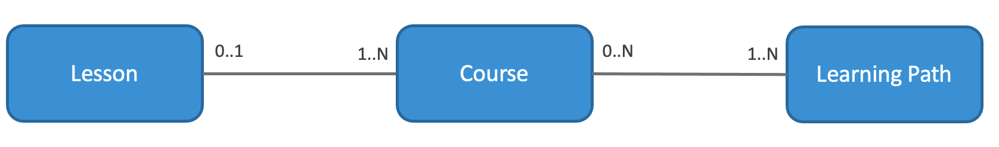
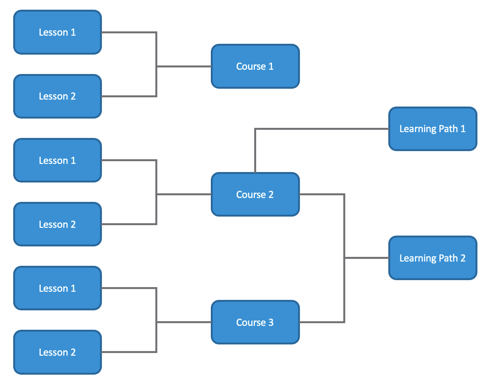

# Overview

The KubeAcademy platform is a custom built CMS style system that serves and hosts
the content on the KubeAcademy website. There is an admin interface to create objects
and add content to the site. The current focus is around video and lab content.

# Main Curriculum Objects

The primary objects/components of KubeAcademy curriculum and their relationsihps are represented as follows:

The course is the main item in the system and is made up of lessons. The lessons can be
various pieces of content (video, labs, etc.). Learning Paths are a way to link multiple
courses together in a guided way for a learner. Below is an example of the model populated
with examples:

Regardless of the type of curriculum object, the following attributes are common across objects:

* `Title`
* `Slug` - ID used in the URL
* `Body` - Description of the course
* `Status` - Live or Draft (hidden from the public)

## Course

[Courses](https://kube.academy/courses) are the primary entity in the system and how folks
mostly discover and interact with the system. They are fairly stand-alone. A course
has the following attributes relevant from a curriculum/content perspective in addition
to the common ones:

* `Color` - Background color of main course page
* `Thumbnail`
* `Overlay`
* `Level` - Beginner, Intermediate, or Advanced
* `Lessons` - List of lessons associated with this course and the order in which they should appear
* `Gated` - Whether the course requires a KubeAcademy account to be taken
## Lesson

Lessons exist to be used in Courses. While it is possible to create a lesson that is
not associated with a course, there is no way to access independently on the site. Instead it
is viewed within the context of a course. The URL pattern reflects that as well. For example:

https://kube.academy/courses/kubernetes-core-concepts-part-1/lessons/kubernetes-fundamentals

A lesson has the following attributes relevant from a curriculum/content perspective in addition
to the common ones:

* `Transcript` - When using video content, the transcript of recorded video.
* `Dureation` - The length in seconds of the lesson
* `Links` - List of URLs to display for the learner to browse to for the lesson

### Lesson Content

A lesson can be one of the following:

* **Video** - The ID of a video hosted on [Vimeo](https://vimeo.com/).
KubeAcademy will embed the video within the site.
* **Lab** - Currently supported lab platforms are:
  * [Tanzu Learning Center](https://docs.vmware.com/en/Tanzu-Application-Platform/1.0/tap/GUID-learning-center-about.html)
  * [Katacoda](https://www.katacoda.com/)

In addition to the above, techincally a lesson could also just include links to
external content. This would be useful if you're linking to a lesson, content, etc.
that is hosted somewhere outsie of KubeAcademy but you want to include in your course.

## Learning Path

A [Learning Path](https://kube.academy/paths)
is a collection of one or more Courses. One way to think of it
is like a `Playlist` on sites like YouTube. It points to existing Courses and
puts them in an ordered fashion.

Other than the common attributes for all curriculum objects in KubeAcademy, a
Learning Path only has a list of attached/linked courses. If a course and it's
lessons are modified/updated, then those updates are reflected when viewing them
from a learning path since they are just linking to those objects.

# Tracking and Reporting