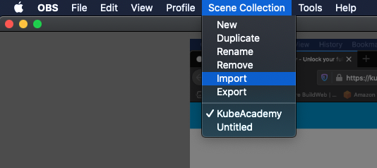
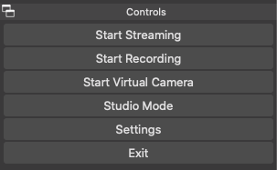
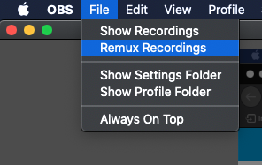
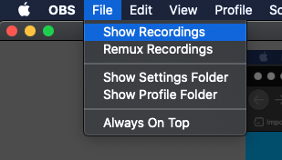
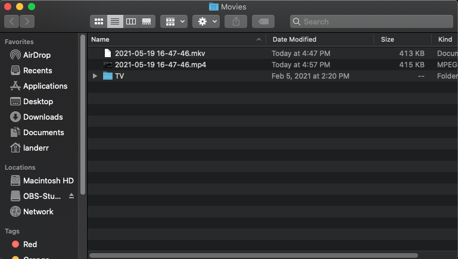

# Open Broadcaster Software Studio

Open Broadcaster Software Studio is a free and open source software for you to use to record lessons for KubeAcademy.  

To get started, download and run the installer

It provides convenient methods to define "Scenes" that include various input devices such as your microphone, a camera or your screen.

## Download and Install OBS

Read the [OBS Studio Quickstart](https://obsproject.com/wiki/OBS-Studio-Quickstart) for information on how to change default settings for audio devices and video sources. 

To download and install OBS Studio:

1. Go to [Open Broadcaster Software (OBS)](https://obsproject.com/).
2. Select the operating environment to install OBS. There are three choices: Windows, macOS 10.13+, and Linux.

   The OBS installer appears in the bottom, left corner of the page.

3. Select the OBS installer.

   The OBS-Studio panel appears.

   

4. Select OBS.

   The Auto-Configuration Wizard appears.

   Note: The auto-configuration wizard appars the first time you run OBS. To manually open the wizard, go **Tools** > **Auto-Configuration Wizard**.

4. Run the auto-configuration wizard.
   
   The wizard automatically tests your system to define default settings for options such as recording, resolution, and, bitrate. You can manually change these settings later. 

5. Set up your audio devices by doing one or both of the following, depending on your operating system:
   
   - **For macOS Users Only**. Download and install [Blackhole Audio](https://obsproject.com/forum/resources/mac-desktop-audio-using-blackhole.1191/) before continuing to the next step. This app provides direct capture methods for desktop audio devices for your MacOS. 
   - Verify that the default audio and microphone devices are working properly. To do this, open the OBS Studio window and look at the volume meters in the mixer section. If there is a problem with audio or if you want to change the devices in use, go **Settings** > **Audio**.

6. From the Scenes and Sources panel, [add scenes for your video](https://obsproject.com/wiki/OBS-Studio-Overview#scenes-and-sources). This includes webcams and any other devices or media that you want in the output. 

### Configure OBS to Create a Video

To configure OBS: desk perpindicutlar to the window.

1. From the OBS menu bar go **Scene Collection** > **Import**

   The Scene Collection Importer appears.

   

2. Select **Add** at the bottom of the panel. 

   A navigation panel opens. 

3. From the panel, go **GitHub** > **Onboarding** > **Recording** > **obs-kubeacademy-scenes.json**
4. Select **Open** at the bottom of the panel.

2. Go to [OBS](https://obsproject.com/) and import the scene collection config.

 

   Three scenes display in the Scenes and Sources panel. These include: 
   
   - **ScreenCap**. Lets you capture your screen and mic at the same time.
   - **Camera**. Lets you capture your webcam and mic.
   - **PinP**. Lets you capture all three scenes. It captures your screen as the primary with your camera picture-in-picture.

     
   
3. Configure each source so that it connects to your computer. This configuration is necessary because the original scene collection file that was exported came from another computer with different sources.

   

4. Select the three devices. Click the cogwheel icon at the bottom of the pane. 

5. Open the preferences for OBS.

   

6. Select **Video** from the panel on the left. Set the Base and Output resolution to 1920x1080.

   

If you make a mistake when recording an actual lesson, here's what to do:
  - Go back to the last transition point. For example, if you made a mistake at the point where you switched slides in a deck, go back and resume recording from there.  
  - Cut the mistake out of the recording later.

## Recording

You should now be ready to do a test recording.  In the "Controls" pane, click "Start Recording."

Test each of the three scenes.  Say a few words to test the mic pick up.  Then click "Stop Recording."

When recording an actual lesson, if you make a mistake, go back to the last transition point - such as when you switched slides in a deck - and resume from there.  The flub can be edited out later.

## Remux the Recording

OBS records to an `.mkv` file.  The lessons you submit need to be in `.mp4` format.  Select "Remux Recordings" from the File menu.

In the dialogue that opens, click the browse button to navigate to the file that was just saved.

Select the file and then click "Remux" at the bottom-right.

Short recordings will process quickly.  Longer recordings will take more time.

Once OBS tells you the remux is complete, you can view the files by selecting "Show Recordings" from the File menu.

That will open a file browser.  You should see the original `.mkv` file alongside the `.mp4` file.  Open the `.mp4` file and watch the video to ensure the output is as expected.

Rename to the `.mp4` file to include the course and lesson names and upload it to the appropriate location in  Google Drive.

