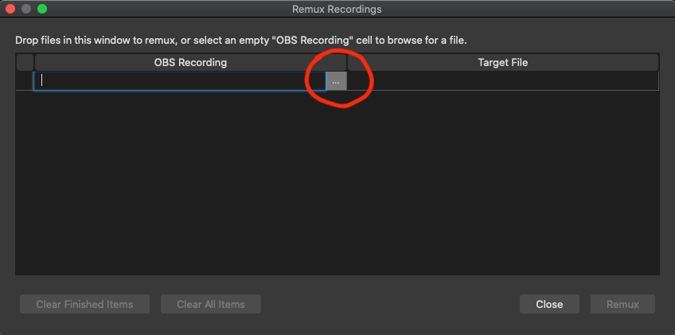

# Open Broadcaster Software Studio

Open Broadcaster Software Studio is a free and open source software that you can use to record lessons for KubeAcademy.  
provides convenient methods to define "Scenes" that include various input devices such as your microphone, a camera or your screen.

This document will help you get up and running with [Open Broadcaster Software (OBS)](https://obsproject.com/).

## Download and Install OBS

Once you download OBS Studio, OBS is available for Linux, Mac, and Windows operating systems. To download OBS Studio:

1. Go to the [Download OBS Studio](https://obsproject.com/download) page. and select **Download Installer**. 
2. Select the OBS installer at the bottom, left corner of the page.
   The Auto-Configuration Wizard opens.
3. Follow the Auto-Configuration Wizard steps to install OBS Studio. 
4. Set up your audio devices.
5. Add your video sources.

You can install OBS Studiohttps://obsproject.com/wiki/OBS-Studio-Quickstart

## Configuration

1. Verify that OBS is installed.

2. Download the following scene collection config file.
   `obs-kubeacademy-scenes.json`.

3. From OBS, import the scene collection config.

   

   Three items appear in the Scenes pane, under Sources.

   

   - The **ScreenCap** scene allows you to capture your screen and mic at the same time.
   - The **Camera** scene allows you to capture your webcam and mic.
   - The **PinP** captures all three.  It captures your screen as the primary with your camera picture-in-picture.

   Three devices appear under "Sources." You need to configure these devices to connect to your computer. The reason is that the imported scene collection file was exported from another computer with different devices attached.  

   

4. Select each device. Click the cogwheel icon at the bottom of the pane. Set them to use the appropriate device for your setup.

Lastly, open the preferences for OBS.

Select "Video" from the panel on the left and set the Base and Output resolution to 1920x1080.

## Recording

You should now be ready to do a test recording.  In the "Controls" pane, click "Start Recording."

Test each of the three scenes.  Say a few words to test the mic pick up.  Then click "Stop Recording."

When recording an actual lesson, if you make a mistake, go back to the last transition point - such as when you switched slides in a deck - and resume from there.  The flub can be edited out later.

## Remux the Recording

OBS records to an `.mkv` file.  The lessons you submit need to be in `.mp4` format.  Select "Remux Recordings" from the File menu.

In the dialogue that opens, click the browse button to navigate to the file that was just saved.

Select the file and then click "Remux" at the bottom-right.

Short recordings will process quickly.  Longer recordings will take more time.

Once OBS tells you the remux is complete, you can view the files by selecting "Show Recordings" from the File menu.

That will open a file browser.  You should see the original `.mkv` file alongside the `.mp4` file.  Open the `.mp4` file and watch the video to ensure the output is as expected.

Rename to the `.mp4` file to include the course and lesson names and upload it to the appropriate location in  Google Drive.

